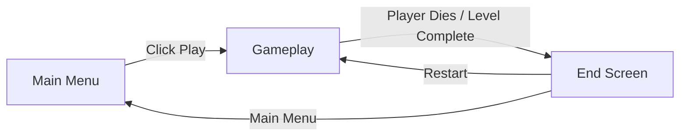
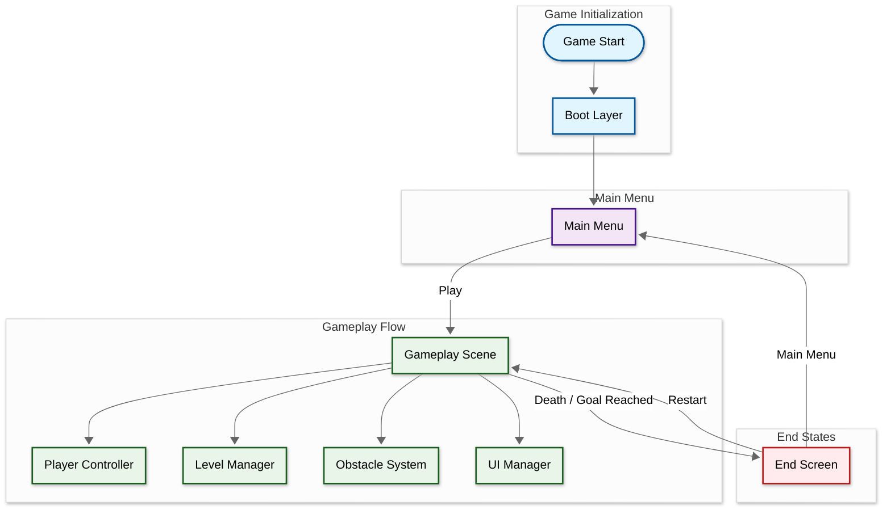
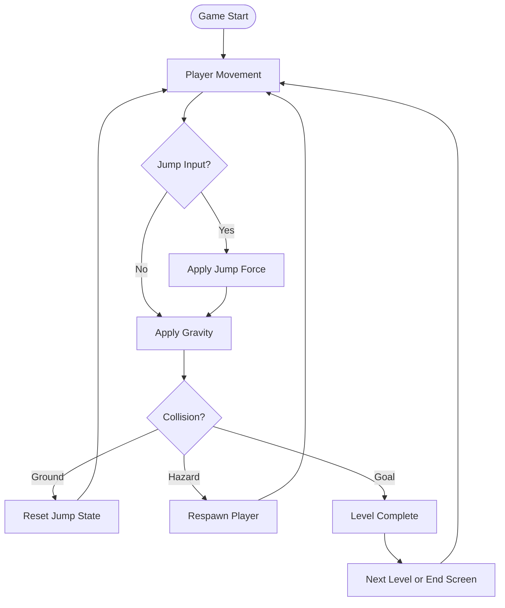

Developer & Contributions

NichoAndianto (Game Developer)
<br>

About

Side-Scrolling Platformer [Prototype] is a 2D action platformer project developed to explore character movement, obstacle interaction, and progressive level design. The game focuses on smooth player control, responsive jumping, and engaging level flow. My contributions include designing the movement system, implementing physics-based interactions, and developing the level progression framework.

<br>

Key Features

Responsive Controls: Smooth horizontal movement, jumping, and mid-air adjustments.

Obstacle Interaction: Collision-based physics for traps, platforms, and collectibles.

Level Progression: Structured stages with checkpoints and end-goals.

Simple Aesthetic: Clean visual design emphasizing clarity and flow.

<br>
## Scene Flow 


## Layer / module Design 



<br>
## Module and Features

| 📂 Name              | 🎬 Scene                  | 📋 Responsibility                                                                                                      |
| -------------------- | ------------------------- | ---------------------------------------------------------------------------------------------------------------------- |
| **MainMenu**         | **Main Menu**             | - Display UI<br/>- Start game or exit                                                                                  |
| **PlayerController** | **Gameplay**              | - Handle horizontal movement and jumping<br/>- Detect collisions with environment<br/>- Manage respawn and checkpoints |
| **LevelManager**     | **Gameplay**              | - Manage level start and completion<br/>- Handle transitions and reset                                                 |
| **ObstacleSystem**   | **Gameplay**              | - Detect traps and hazards<br/>- Trigger player death or respawn                                                       |
| **UIManager**        | **Gameplay / End Screen** | - Show player status, score, and level completion<br/>- Handle restart and menu navigation                             |
| **GameOver**         | **End Screen**            | - Display end state (Win/Lose)<br/>- Restart or return to main menu                                                    |

<br>



<br>

```mermaid
classDiagram
    %% --- Core Gameplay ---
    class PlayerController {
        +OnMoveHorizontal()
        +OnJump()
        +OnLand()
        +OnRespawn()
        +OnCollectItem(itemName: string)
    }

    class LevelManager {
        +OnLevelStart(levelName: string)
        +OnCheckpointReached()
        +OnLevelComplete()
    }

    class ObstacleSystem {
        +OnPlayerHit()
        +OnHazardTriggered()
    }

    class UIManager {
        +OnUpdateHealth(value: int)
        +OnShowGameOver()
        +OnShowLevelComplete()
    }

    %% --- Systems ---
    class GameManager {
        +OnGameStart()
        +OnPlayerDeath()
        +OnRestartLevel()
    }

    class AudioManager {
        +OnPlaySFX(effectName: string)
        +OnPlayBGM(trackName: string)
    }

    %% --- Relations (who triggers what) ---
    PlayerController --> LevelManager : triggers progression
    PlayerController --> ObstacleSystem : interacts with
    ObstacleSystem --> GameManager : notifies death
    LevelManager --> UIManager : updates UI state
    GameManager --> AudioManager : plays sound events
    GameManager --> UIManager : controls end screen

'''
